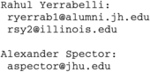

# Yerrabelli-Spector-Poroelastic-Model-Code
 
**NOTE: For the most updated version of this document and all associated code and files, see: https://github.com/ryerrabelli/Yerrabelli-Spector-Poroelastic-Model-Code**

## Contact  
 Developed by [Rahul S. Yerrabelli](https://orcid.org/0000-0002-7670-9601)1,2 in the lab of [Nai-Kong V. Cheung, MD, PhD](https://orcid.org/0000-0001-6323-5171
)1.  

Made by Rahul Yerrabelli for Dr. Alexander Spector's lab at 
Johns Hopkins University, Department of Biomedical Engineering. 2017-2020.
To contact authors, email us at "aspector at jhu dot edu" for Dr. Spector and
"ryerrab1 at alumni dot jh dot edu" or "rsy2 at illinois dot edu" for Rahul 
(replace "at" with "@" and "dot" with ."; this was done to prevent spam).

Code created and tested on MATLAB® 2017a for Mac.

# Pharmacokinetic Modeling and Optimization of Omburtamab (8H9) Delivered Through the CSF  

**NOTE: For the most updated version of this document and all associated code and files, see: https://github.com/ryerrabelli/8H9-Model-Essentials-Public**

## Contact  
Code was created by [Rahul S. Yerrabelli](https://orcid.org/0000-0002-7670-9601)1,2 in the lab of [Alexander A. Spector](https://orcid.org/0000-0003-0701-8185
)1.  
 1. [Johns Hopkins University, Department of Biomedical Engineering, Baltimore, MD, USA](https://www.mskcc.org/research-areas/labs/nai-kong-cheung)  
 1. [Carle Illinois College of Medicine, University of Illinois at Urbana-Champaign, Urbana, IL, USA](https://medicine.illinois.edu/).  

## Background  
* The code here is what I used to create the analyses in our manuscript, which was accepted for publication on Nov 8, 2020 to [Medical & Biological Engineering & Computing (MBEC)](https://www.springer.com/journal/11517). The manuscript title is ["**IModeling the Mechanics of Fibrous-Porous Scaffolds for Skeletal Muscle Regeneration**" by Rahul S. Yerrabelli, Sarah M. Somers, Warren L. Grayson, and Alexander A. Spector.
* The outputs of the mathematical derivations are represented in these files and subsequently plotted.
* The modeling project spanned Sep 2017 - Nov 2020.  
* All code is in MATLAB®.

## Instructions for Understanding the Model's MATLAB® Code  
* Each of the major mechanical functions (specifically displacement, fluid velocity, pressure, and radial strain) are represented as separate .m files. Different files are also used for the parameters under ramped (increasing at a constant rate, then staying at a max) and harmonic (sinusoidal) strain conditions.
  * Ramped strain functions
    * **[ramped_displ_eqn.m](ramped_displ_eqn.m)**
    * **[ramped_fluidvel_eqn.m](ramped_fluidvel_eqn.m)**
    * **[ramped_press_eqn.m](ramped_press_eqn.m)**
    * **[ramped_radialstrain_eqn.m](ramped_radialstrain_eqn.m)**
    * A separate solid velocity (velocity) function was not created as it can just be calculated as the numerical derivative of displacement.
    * **[ramped_relvel_eqn.m](ramped_relvel_eqn.m)** <- This file is not truly necessary as it can be calculated from fluid velocity and solid velocity (itself calculable from displacement).
    * **[ramped_force_eqn.m](ramped_force_eqn.m)** <- The force function under ramped strain has already been well described for decades in prior literature, and thus was not a focus of our studies. It is included only for completion.
  * Harmonic functions
    * **[harmonic_displ_eqn2.m](harmonic_displ_eqn2.m)**
    * **[harmonic_fluidvel_eqn2.m](harmonic_fluidvel_eqn2.m)**
    * **[harmonic_press_eqn2.m](harmonic_press_eqn2.m)**
    * **[harmonic_radialstrain_eqn2.m](harmonic_radialstrain_eqn2.m)**
    * A separate solid velocity (velocity) function was not created as it can just be calculated as the numerical derivative of displacement.
    * A separate relative velocity function was not created as it can simply be calculated from fluid velocity - d/dt(displacement) as shown in main.mlx
    * A force function under harmonic strain was not created.
* The main.mlx file runs the above equations under various conditions (time, radial position, etc) and plots them. Many of the analyses runs and followup plotting take several minutes to run.

## Notes, Warnings, and Potential Sources of Confusion  
* The "2" at the end of the harmonic function file names (i.e. **[harmonic_displ_eqn2.m](harmonic_displ_eqn2.m)**) does not mean the output is squared. It was only named this way because it was the second version of the code we made. 
* In general, the outputs are made to be non-dimensional (i.e. by dividing by a reference unit such as radius length for the displacement output). Internally in the code, we tried to stick to SI units.  

## Tested OS and History Details  
* Code created and tested on MATLAB® 2017a for Mac (macOS Mojave, 2018 MacBook Pro 15in).

